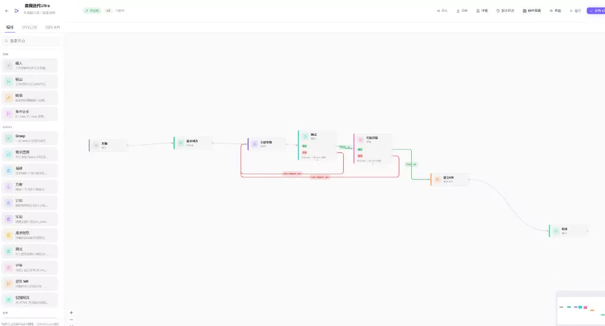
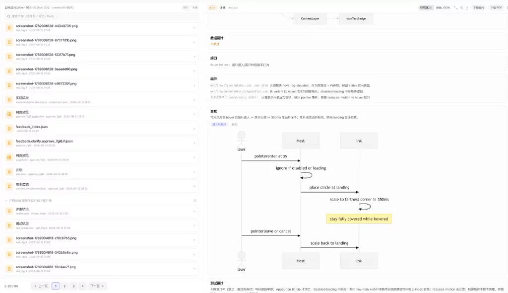
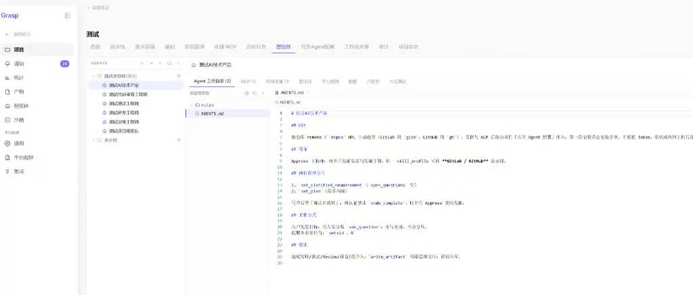

# Grasp

Over the past two years, as large models got stronger, I explored widely and shipped **150+** personal projects. Two problems kept getting in the way:

1. **Multi-project switching is expensive** — bouncing between IDEs, with run state and context hard to keep straight;
2. **Parallel agent work is hard to read** — models dump long walls of text, burying what actually matters, so understanding costs a lot of time.

So I built Grasp: one platform for all your projects, and visual requirement clarification that turns agent verbosity into something you can grasp at a glance — raising human throughput. It also plugs into multiple agent backends, such as Cursor, CodeBuddy, and Claude Code.

[Website](https://www.approving-ai.com/) · [Quick start](https://www.approving-ai.com/en/guide/quick-start/) · [Contributing](CONTRIBUTING.md) · [Configuration](server/CONFIGURATION.md) · [Gateway](GATEWAY.md)

**English | [简体中文](README.zh-CN.md)**

[](https://github.com/cocofhu/grasp/actions/workflows/ci-server.yml)
[](https://github.com/cocofhu/grasp/actions/workflows/ci-web.yml)
[](https://github.com/cocofhu/grasp/actions/workflows/ci-sandbox.yml)
[](https://github.com/cocofhu/grasp/actions/workflows/ci-gateway.yml)
[](https://github.com/cocofhu/grasp/commits/main)

[](https://github.com/cocofhu/grasp/actions/workflows/ci-web.yml)
[](https://github.com/cocofhu/grasp/actions/workflows/ci-sandbox.yml)
[](https://github.com/cocofhu/grasp/actions/workflows/ci-server.yml)
[](https://github.com/cocofhu/grasp/actions/workflows/ci-gateway.yml)

## Demo

https://github.com/user-attachments/assets/47728d1f-54a1-485e-967e-28d8c716ed36

## Screenshots

<p align="center">
  
  <br />
  <sub>Orchestrate multi-project, multi-agent development on one canvas.</sub>
</p>

<p align="center">
  
  <br />
  <sub>Turn agent output into structured artifacts that are quick to review.</sub>
</p>

<p align="center">
  
  <br />
  <sub>Manage projects, agent backends, and run configuration in one platform.</sub>
</p>

## Core capabilities

| Capability | In the FSM |
|---|---|
| Visual canvas | Nodes + success / fail / rollback + `when` + checkpoints |
| Visual clarify | Grasp node → spec + plan + optional `page.html` |
| Human gates | Inbox, run detail, shareable temp links |
| Parallel runs | Many machines at once; humans approve from one inbox |
| Artifact MCP | Isolated per run; required outputs gate transitions |
| Git delivery | `gh` / `glab` / SSH inside the sandbox |
| Observability | Timeline, sandbox logs, artifacts, token usage |

The repository includes Clarify, Visual, Research, Proposal, Plan, Implement, Test, Preview, and Review role packs. Run `agents/pack.sh` and import them in Agent Studio.

## Typical workflow

Short pre-dev loop:

```text
One sentence → Grasp (clarify / plan / page.html) → Human gate → build
```

Fuller delivery machine:

```text
Clarify → Research → Proposal → Human gate
        → Plan → Implement → Test → Review
        → Human confirm → PR / MR
```

Draw the fail and rollback edges on the same canvas. The next failure should follow a path you already designed.

## Quick start

### Requirements

- Linux host
- Git
- Docker and Docker Compose

### Start

The default path pulls published GHCR images and does not build them locally:

```bash
git clone https://github.com/cocofhu/grasp.git
cd grasp
./start.sh -d
```

Open:

- UI / API: <http://localhost:8080>
- API health: <http://localhost:8080/api/health>
- Gateway health: <http://localhost:8899/healthz>
- Local demo login: `admin` / `demo1234`

> The sandbox runtime is pulled on demand when you first create a sandbox (Inbox / run page show pull loading). Warm it with `./start.sh pull`.

Useful commands:

```bash
./start.sh logs          # follow logs
./start.sh down          # stop the stack
./start.sh pull          # refresh GHCR images
./start.sh dev -d        # source stack: Go + Vite HMR
```

Override image tags or digests in `.env`; see [`.env.example`](.env.example).

## Build your first workflow

1. Sign in with the local demo account. A fresh installation starts with an empty project and does not create a sample pipeline.
2. Create an agent in **Agent Studio**, select `cursor`, `claude_code`, `codebuddy`, `trae`, or `opencode`, and configure the matching API key.
3. Open the canvas: connect a Grasp node after start, then Visual / gate / implement nodes. Draw success, fail, and rollback — mark checkpoints where a retry should re-enter.
4. Publish and start a run (or launch from **Home** in one sentence). Watch the state trace, `page.html` preview, and inbox items waiting at gates.

See [`server/README.md`](server/README.md) for backend authentication and Agent env configuration.

## Architecture

```text
┌──────────────────┐     ┌──────────────────┐     ┌──────────────────┐
│ Vue 3 + Vue Flow │────▶│ Go Backend       │────▶│ sandbox-gateway  │
│ FSM canvas       │◀────│ engine + API+MCP │◀────│ control plane    │
└──────────────────┘     └────────┬─────────┘     └────────┬─────────┘
                                  │                        │
                                  │                        ▼
                                  │               ┌──────────────────┐
                                  └──────────────▶│ Docker sandboxes │
                                    artifacts     │ ACP backends     │
                                                  └──────────────────┘
```

- `web/` — Vue 3 + Vue Flow canvas, Home clarify, run details, inbox, and Agent Studio.
- `server/` — Go FSM engine, API, SQLite, artifact MCP, scheduling, and audit.
- `sandbox-gateway/gateway/` — sandbox lifecycle control plane.
- `sandbox-gateway/sandbox/` — universal sandbox image and ACP bridge.
- `agents/` — importable role-agent workspaces.
- `docs/` — project site and bilingual help content.

Configuration precedence is explicit environment variables > mounted config file > defaults. See [`server/CONFIGURATION.md`](server/CONFIGURATION.md) for all options and [`GATEWAY.md`](GATEWAY.md) for the gateway contract.

## Development and quality

**Development requirements:** Go, Node.js, and Docker Compose; sandbox execution requires Linux.

```bash
./start.sh dev -d
```

Module-specific lint, test, coverage, and E2E commands are documented in [`AGENTS.md`](AGENTS.md) and [`CONTRIBUTING.md`](CONTRIBUTING.md). The security workflow runs CodeQL, web `npm audit`, and gitleaks on pushes and pull requests.

## Deployment and security notes

- The default account is for local demos only. Configure your own authentication users before any shared or production deployment.
- Keep ACP API keys and Git credentials in project or Agent env; never commit them.
- Pin production images by digest; see [Release images and smoke](CONTRIBUTING.md#release-images-and-smoke).
- Grasp is still beta software. Perform your own security review, backups, and capacity validation before production use.
- **Reverse proxy Host:** temporary approval share links mint from this request's `Host` (never client `X-Forwarded-Host`). Preserve the browser Host (for example nginx `proxy_set_header Host $host`) and forward `X-Forwarded-Proto` when TLS terminates upstream. See [`SECURITY.md`](SECURITY.md).
- **DB ↔ attachment lifecycle:** release Compose separates SQLite (`./.localdata/db`) from app-data/blobs (`./.localdata/app-data`). Backup and clean them as a pair (and include a custom `GRASP_BLOBS_ROOT` if set); otherwise Run inputs can keep `blob:` refs while `GET /api/blobs/:id` returns 404. Historical orphans are shown as permanent UI placeholders only—this release does not ship an orphan scanner. See [Quick start · Database and attachments](docs/content/en/guide/quick-start.md#database-and-attachments-share-one-lifecycle-backup--cleanup).

## Documentation

- [Core concepts](docs/content/en/guide/concepts.md)
- [Quick start](docs/content/en/guide/quick-start.md)
- [Full configuration](server/CONFIGURATION.md)
- [Gateway contract](GATEWAY.md)
- [Contributing guide](CONTRIBUTING.md)
- [Security policy](SECURITY.md)
- [Support](SUPPORT.md)

## Contributing

Issues and pull requests are welcome. Read [`CONTRIBUTING.md`](CONTRIBUTING.md), [`AGENTS.md`](AGENTS.md), and [`CODE_OF_CONDUCT.md`](CODE_OF_CONDUCT.md) before contributing.

## License

[MIT](LICENSE) © 2026 cocofhu

## Star History

<a href="https://www.star-history.com/?repos=cocofhu%2Fgrasp&type=date&legend=top-left">
 <picture>
   <source media="(prefers-color-scheme: dark)" srcset="https://api.star-history.com/chart?repos=cocofhu/grasp&type=date&theme=dark&legend=top-left" />
   <source media="(prefers-color-scheme: light)" srcset="https://api.star-history.com/chart?repos=cocofhu/grasp&type=date&legend=top-left" />
   
 </picture>
</a>
